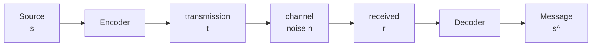

# Information Theory, Pattern Recognition, and Neural Networks.
## David MacKay (University of Cambridge) 2012
### Lecture 1: Introduction to Information Theory

[Lecture on Youtube](https://www.youtube.com/watch?v=BCiZc0n6COY&list=PLruBu5BI5n4aFpG32iMbdWoRVAA-Vcso6&index=1)

Improve (speed / reliability) communications two approaches:
- physical solutions: better cables / insulation.
- system solution: accept physical limitations, improve reliability with encoding / decoding.

Encoder adds redundancy
Decoder uses redundancy to infer n & s

Toy model:  Binary symmetric channel

Input 0 or 1  
Output 0 or 1  

P(Input == Output) = 1 - f  
P(Input != Output) = f  

Example f = 0.1  10000 bits transmited.  

Q1. Expected flipped bits and variance.  
A1. Expect 1000 bits flipped ± 900 (Variance n*p(1-p) 10000 * 0.1 * 0.9)  

Note: Binomial Distribution prerequisite for course  

Q2. 1 GByte USB stick, how low does f need to be for it to be useable / saleable.  
A2. Aim for 10^-15 or better. Redundancy and Encoding to achieve this.  

Redundancy options:
- parity coding
- repetition coding example 0 -> 000 1 -> 111 (r3)

source   s = 0   1   1   0   1  
transmit t = 000 111 111 000 111  
noise n    = 000 100 000 101 000  
receive r  = 000 011 111 101 111  
decode s   = 0   1   1   1   0    (example mean/majority/ best of 3)  

repetition example (r3) doesn't get close to 10^-15  

Why best of 3, inference (Inverse probability)
1. Product Rule P(s,r) = P(s)P(r|s) = P(r)P(s|r)
2. Sum rule P(r) sum over P(s,r) = P(s=0,r) + P(s=1,r)

Posterior probability of s P(s|r) = P(r|s)P(s) / P(r) 

Eg. r = 011  
P(r|s=0)  (1-f)(f)(f) 0.9 * 0.1 * 0.1 = 0.009   (10%)
P(r|s=1)  (f)(1-f)(1-f) 0.1 * 0.9 * 0.9 = 0.081 (90%)

How well does a decoder perform  
Forward Probability  

Q3. 1 bit across channel with noise f  
  
s --> encode r3 --> channel f --> decode majority --> s^  
  
What is P(s^ != s)  

A3. Use Binomial Distribution  
all three flip f^3, plus two flips 3f^2(1-f)  

r3 rate = 1/3 error is ~3f^2 

Homework problem how many repetitions needed to achieve 10^-15 or better  
(answer about 61!)  

#### 7,4 Hamming Code
[47:34](https://youtu.be/BCiZc0n6COY?list=PLruBu5BI5n4aFpG32iMbdWoRVAA-Vcso6&t=2854)  
  
4 source bits converted to 7 transmitted bits.  

1000 --> 1000 101  
1110 --> 1110 100  

The 3 additional bits used to keep even parity

On the decoder flipped bits may or may not break the parity

Pattern of correctness or not of the recieved message parity is known as the syndrome.

Rules to determine likely cause:  
- Intersection of all where parity is odd.

Any single flip can be detected and corrected.
If more than one flip occurs, then guess will be incorrect.

#### Shannon - how far can we improve

Boundary of achievable and unachievable does not go to 0, it goes to some non-zero point labelled as C (capacity of the channel)  

> $$ C(f) = 1 - H_2(f) = 1 - \left[ f\text{ }log_2 \frac{1}{f} + (1 - f)log_2 \frac{1}{1-f}\right] $$

an f of 0.1 there exists an encoding / decoding strategy that results in a capacity of ~0.53

This is Shannon's [Noisy-channel coding theorem](https://en.wikipedia.org/wiki/Noisy-channel_coding_theorem)  
