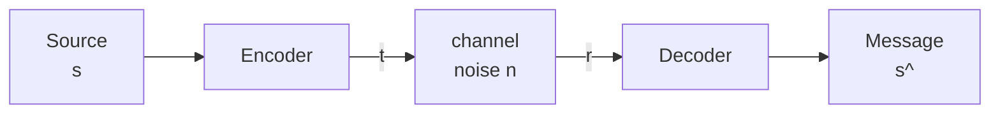
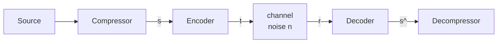

# Information Theory, Pattern Recognition, and Neural Networks.
## David MacKay (University of Cambridge) 2012
### Lecture 2: Entropy and Data Compression (I)
#### Introduction to Compression, Inf.Theory and Entropy

[Lecture on Youtube](https://www.youtube.com/watch?v=BCiZc0n6COY&list=PLruBu5BI5n4aFpG32iMbdWoRVAA-Vcso6&index=2)

Source data usually has redundancy built in for example english text, we add a compressor before the encoder and a decompressor after the decoder.

- Source Coding: Compressor & Decompressor
- Channel Coding: Encoder & Decoder

## Source Coding

### A bent coin

$ x \in \{tails, heads\} $  
$ P(x = tails) = 0.9 $  
$ P(x = heads) = 0.1 $  

File with 1000 results. How much information does it contain, what is the smallest file size we can compress to.

In general an Ensemble X has
- a random variable
- an Alphabet (possible outcomes)
- a probability distribution

> $$ X \text{ is } \{ x, Ax, Px \} $$ 
> $$ Ax = \{a_1, a_2, ... a_n \} $$  
> $$ Px = \{p_1, p_2, ... p_n \} $$  

> such that   
> $$ P(x=a_i) = p_i $$  
> $$ \displaystyle\sum_{i=1}^{n} p_i = 1 \qquad p_i \geq 0$$

### Shannon Information Content

The Shannon information content of an outcome:

> $$ x = a_i $$  
> $$ h(x=a_i) = log_2 \frac{1}{P(x=a_i)} \quad \text{bits}$$  

Probability 1 has zero information content

Probability of 1/2 has information content 1 bit:

> $$ log_2 \frac{1}{0.5} = log_2(2) = \: \text{1 bit}$$  

Probability of 0.1:
> $$ log_2 \frac{1}{0.1} = log_2(10) = \: \approx \text{3.32 bits}$$

Probability of 0.9:
> $$ log_2 \frac{1}{0.9} = log_2(1.11) = \: \approx \text{0.15 bits}$$

h(x) is the possible compressed file length

#### Independent Random Variables

Information content is additive for independent random variables

eg XY
> $$ P(x,y) = P(x)P(y) \quad \text{ for all } x,y $$  
> $$ h(x,y) = log_2 \frac{1}{P(x,y)}$$  
> $$ = log_2 \frac{1}{P(x)} + log_2 \frac{1}{P(y)} $$

### Entropy

The entropy of an ensemble is the average Shannon information content.

> $$ H(X) = \displaystyle\sum_{x} P(x) \: log_2 \frac{1}{P(x)} \quad \text{bits}$$

21:00
