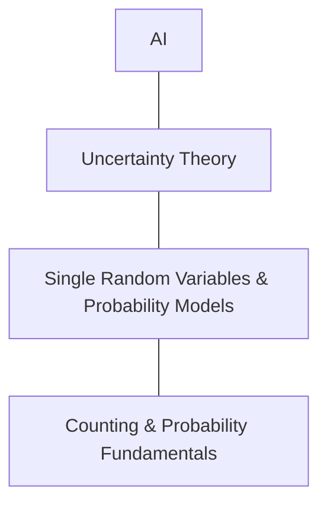

# Stanford CS109 
## Introduction to Probability for Computer Scientists
### Fall 2022
#### Lecture 1 Counting

### AI History

Two Big Ideas

1. Artificial Neuron a probability unit configured with weights. Join very many together in layers.
2. Learn by example, how to set useful weights in the artificial neurons.

Open Problem: One Shot Learning

### Example of probability

A patient has a positive zika test.
0.8% of population have zika.
90% positive rate for people with zika
7% false positive rate 

P(zika|positive test) = 9% 

### Building Blocks

### Counting

- Role a dice 6 outcomes {1,2,3,4,5,6}
- Role even only 3 outcomes {2,4,6}
- Role two dice 36 outcomes {(1,1)(1,2)...(2,1)...(6,6)}

Step Rule of Counting - where |B| is unaffected by |A|
> $$ |A||B| = mn $$

Sum Rule of Counting - outcomes from Set A or Set B
> $$ |A| + |B| \text{ Only if } |A \text{ and } B| = 0 $$

#### Question

How Many 6 digit binary strings start with 01 or end with 10:

- For the prefix the last four digits can be any sequence $ 2^4 $ 
- For the suffix the first four digits can be any sequence $ 2^4 $ 
- we need to minus the overlap $ 2^2 $ (Sum Rule of Counting)

> $$ |A| + |B| - |A \cap B| $$

Therefore answer $ 2^4 + 2^4 - 2^2 $ = 28.

#### Question

How many unique ways to order letters BOBA

> $ (4)(3)(2)(1) = 24 $ then divide by two as half are duplicates = 12

How many unique ways to order letters MISSISSIPPI

Total combinations 11!
- 4! combinations of 4 I's to remove
- 2! combinations of 2 P's to remove
- 4! combinations of 4 S's to remove
- 24 * 2 * 24 = 1152

> $ 11! / 1152 = 34650 $
